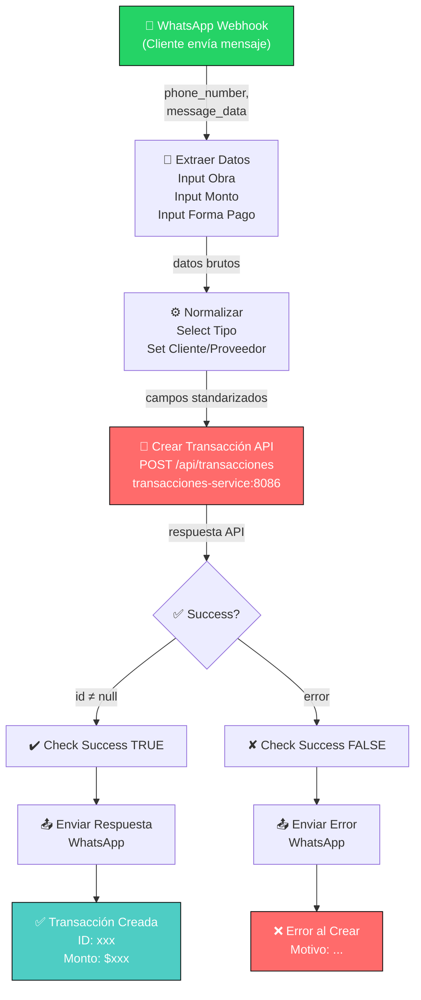
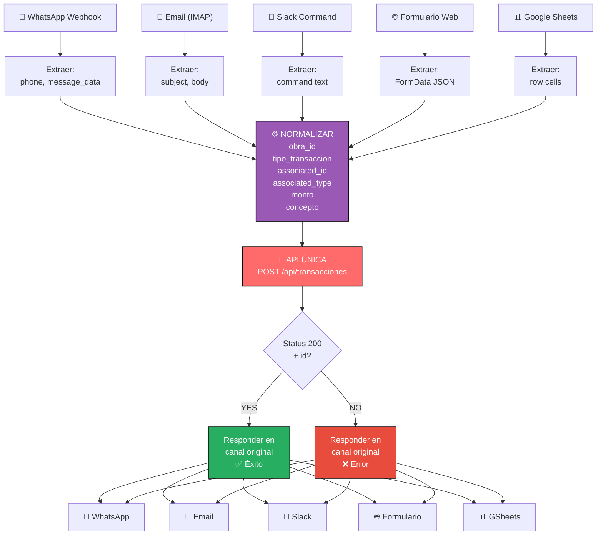
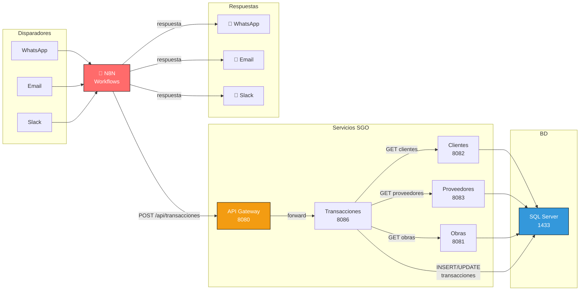
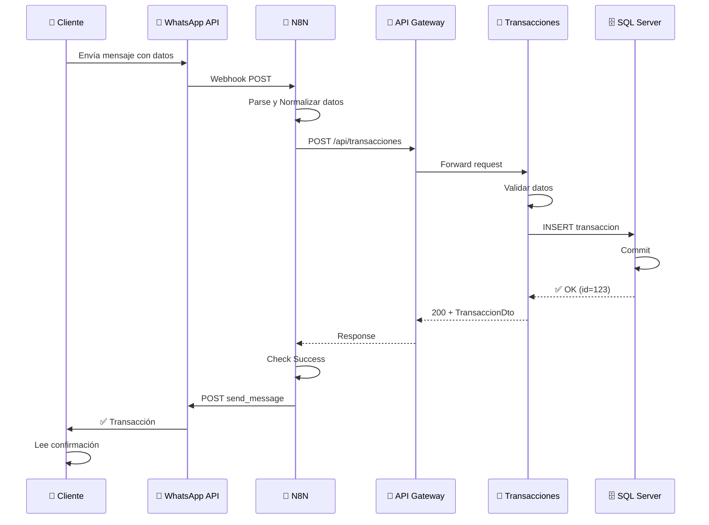
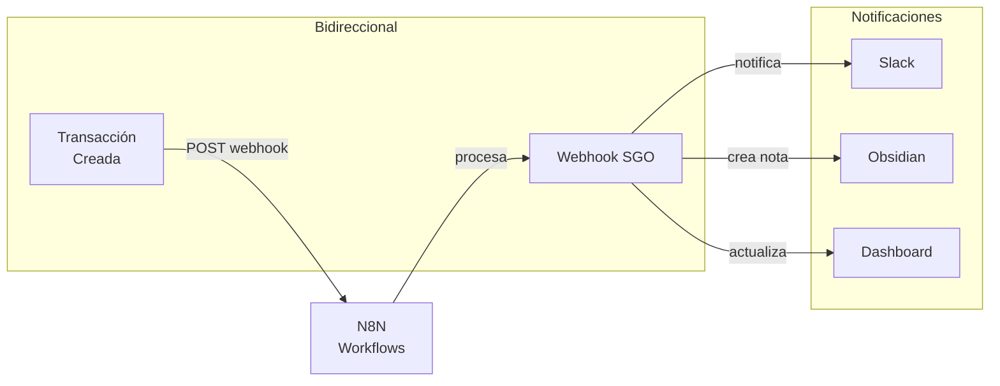

# Workflow N8N - Diagrama Visual y Arquitectura

## Diagrama de Flujo Principal (WhatsApp)



---

## Diagrama Multi-Disparador



---

## Diagrama de Integración con Servicios



---

## Secuencia Temporal: WhatsApp Flow



---

## Variables de Entorno Requeridas

```bash
# .env para n8n

# WhatsApp
WHATSAPP_WEBHOOK_URL=https://api.whatsapp.com/send
WHATSAPP_API_TOKEN=xxx_your_token_xxx
WHATSAPP_BUSINESS_ACCOUNT_ID=xxx

# Email (IMAP)
IMAP_HOST=mail.sgo.local
IMAP_PORT=993
EMAIL_USER=transacciones@sgo.local
EMAIL_PASSWORD=xxx

# Slack
SLACK_BOT_TOKEN=xoxb-xxx
SLACK_SIGNING_SECRET=xxx

# Google Sheets
GSHEETS_ID=xxx_spreadsheet_id_xxx
GSHEETS_API_KEY=xxx

# Telegram
TELEGRAM_BOT_TOKEN=xxx_bot_token_xxx

# MinIO (para archivos)
MINIO_URL=http://minio:9000
MINIO_ACCESS_KEY=minioadmin
MINIO_SECRET_KEY=minioadmin

# SGO API
API_GATEWAY_URL=http://api-gateway:8080
TRANSACCIONES_SERVICE_URL=http://transacciones-service:8086

# Dashboard
DASHBOARD_URL=http://localhost:4200

# N8N
N8N_TIMEZONE=America/Argentina/Buenos_Aires
N8N_DEFAULT_LANGUAGE=es
```

---

## Base de Datos: Tabla de Auditoría N8N

```sql
-- Agregar columna a tabla transacciones para auditoría n8n
ALTER TABLE transacciones ADD COLUMN
    origen_creacion NVARCHAR(50) DEFAULT 'MANUAL';
    -- Valores: 'MANUAL', 'WHATSAPP', 'EMAIL', 'SLACK', 'FORMULARIO', 'GSHEETS'

ALTER TABLE transacciones ADD COLUMN
    id_webhook_n8n NVARCHAR(255);
    -- Para rastrear ejecución de n8n

ALTER TABLE transacciones ADD COLUMN
    telefono_cliente NVARCHAR(20);
    -- Contacto del cliente para respuestas

-- Crear tabla de log de intentos de n8n
CREATE TABLE transacciones_n8n_log (
    id BIGINT NOT NULL PRIMARY KEY IDENTITY(1,1),
    transaccion_id BIGINT,
    workflow_name NVARCHAR(255) NOT NULL,
    disparador_tipo NVARCHAR(50) NOT NULL,  -- WHATSAPP, EMAIL, etc.
    payload_entrada NVARCHAR(MAX),
    respuesta_api NVARCHAR(MAX),
    estado NVARCHAR(20) NOT NULL,  -- SUCCESS, ERROR
    mensaje_error NVARCHAR(500),
    fecha_intento DATETIME2 DEFAULT GETDATE(),

    FOREIGN KEY (transaccion_id) REFERENCES transacciones(id)
);

-- Index para búsquedas rápidas
CREATE INDEX idx_n8n_log_fecha ON transacciones_n8n_log(fecha_intento DESC);
CREATE INDEX idx_n8n_log_disparador ON transacciones_n8n_log(disparador_tipo);
```

---

## API Calls en el Workflow

### 1. Crear Transacción

```http
POST http://api-gateway:8080/api/transacciones
Content-Type: application/json

{
  "id_obra": 1,
  "id_asociado": 5,
  "tipo_asociado": "CLIENTE",
  "tipo_transaccion": "PAGO",
  "fecha": "2026-04-29",
  "monto": 5000.00,
  "forma_pago": "Transferencia",
  "medio_pago": "WhatsApp Bot",
  "concepto": "Pago hormigonado",
  "factura_cobrada": false,
  "activo": true
}

# Response (200 OK):
{
  "id": 123,
  "id_obra": 1,
  "id_asociado": 5,
  "tipo_asociado": "CLIENTE",
  "tipo_transaccion": "PAGO",
  "fecha": "2026-04-29",
  "monto": 5000.00,
  "forma_pago": "Transferencia",
  "medio_pago": "WhatsApp Bot",
  "concepto": "Pago hormigonado",
  "factura_cobrada": false,
  "activo": true,
  "creadoEn": "2026-04-29T14:30:00Z"
}
```

### 2. Obtener Clientes (para validación)

```http
GET http://api-gateway:8080/api/clientes
# Response: Array de ClienteResponse

# O filtrado:
GET http://api-gateway:8080/api/clientes?activo=true
```

### 3. Obtener Obras (para validación)

```http
GET http://api-gateway:8080/api/obras
# Response: Array de ObraResponse

# O por ID:
GET http://api-gateway:8080/api/obras/1
```

---

## Error Handling en el Workflow

```
Escenario: API retorna 400 (validación fallida)
├─ Posible Causa: Monto negativo, cliente inexistente
├─ Manejo: Log en n8n_log tabla
└─ Respuesta: "Validación fallida: ..." en WhatsApp

Escenario: API retorna 404 (recurso no encontrado)
├─ Posible Causa: Obra o cliente no existe
├─ Manejo: Log y sugerencia de verificar IDs
└─ Respuesta: "La obra/cliente no existe. Verifica los datos"

Escenario: API retorna 500 (error interno)
├─ Posible Causa: Error BD, timeout, etc.
├─ Manejo: Retry automático (max 3 veces)
└─ Respuesta: "Error interno. Intenta más tarde"

Escenario: Timeout (>30s)
├─ Manejo: Cancelar y log
└─ Respuesta: "Timeout. Verifica tu conexión"
```

---

## Monitoreo y Observabilidad

### En N8N

**Dashboard Personalizado**:
```
- Ejecuciones totales: X
- Éxitos: X (%)
- Errores: X (%)
- Tiempo promedio: X ms
- Disparador más usado: X
```

### Logs SQL

```sql
-- Contar transacciones creadas via n8n
SELECT
    disparador_tipo,
    COUNT(*) as total,
    COUNT(CASE WHEN estado='SUCCESS' THEN 1 END) as exitosas,
    COUNT(CASE WHEN estado='ERROR' THEN 1 END) as errores,
    AVG(DATEDIFF(MILLISECOND, fecha_intento, fecha_intento)) as tiempo_ms
FROM transacciones_n8n_log
GROUP BY disparador_tipo
ORDER BY total DESC;

-- Errores del último día
SELECT * FROM transacciones_n8n_log
WHERE fecha_intento >= DATEADD(DAY, -1, GETDATE())
  AND estado = 'ERROR'
ORDER BY fecha_intento DESC;
```

---

## Integración Futura: Webhooks Bidireccionales



**Implementación**:
```json
{
  "id": "webhook_transaccion_creada",
  "name": "Escuchar Transacción Creada",
  "type": "n8n-nodes-base.webhookTrigger",
  "parameters": {
    "url": "http://n8n:5678/webhook/transaccion-creada",
    "httpMethod": "POST"
  }
}
```

---

## Checklist de Deployment

- [ ] Variables de entorno configuradas
- [ ] Webhook de WhatsApp registrado
- [ ] Credenciales de proveedores agregadas a n8n
- [ ] Testear cada disparador individualmente
- [ ] Validar respuestas en cada canal
- [ ] Monitorear logs del servicio de transacciones
- [ ] Crear alertas para errores
- [ ] Documentar procesos en Obsidian
- [ ] Capacitar a usuarios finales

---

**Última actualización**: 2026-04-29 | **Versión**: 1.0
